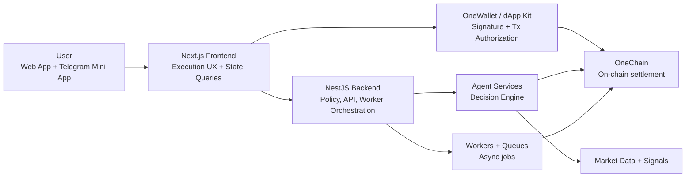
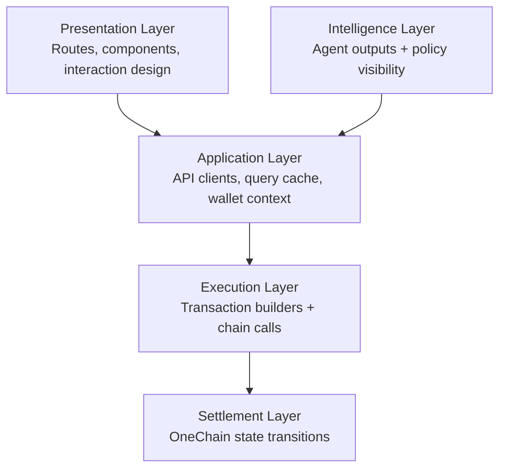

# OneYield Frontend

<p align="center">
  <strong>Deposit once. Route intelligently. Spend responsibly. Compound continuously.</strong>
</p>

<p align="center">
  Frontend control plane for OneYield — a OneChain-native yield utility protocol that turns passive capital into adaptive, policy-guarded financial flows.
</p>

---

## Table of Contents

1. [Executive Summary](#executive-summary)
2. [Problem Statement (Why OneYield exists)](#problem-statement-why-oneyield-exists)
3. [Solution Thesis](#solution-thesis)
4. [Product Architecture (In Depth)](#product-architecture-in-depth)
5. [Agentic Intelligence Pipeline](#agentic-intelligence-pipeline)
6. [Security & Trust Model](#security--trust-model)
7. [Frontend Capabilities](#frontend-capabilities)
8. [API Surface](#api-surface)
9. [Repository Structure](#repository-structure)
10. [Tech Stack](#tech-stack)
11. [Environment Configuration](#environment-configuration)
12. [Runbook: Local Development](#runbook-local-development)
13. [Production Readiness Checklist](#production-readiness-checklist)
14. [Future-Secured Path (TEE + Attestation)](#future-secured-path-tee--attestation)
15. [OneYield × OneChain Growth Path](#oneyield--onechain-growth-path)

---

## Executive Summary

OneYield solves a structural DeFi contradiction: users want compounding exposure and real-life liquidity at the same time.

This frontend provides the operational UX for that model:

- wallet-native auth and transaction signing,
- on-chain deposit/spend/withdraw interaction,
- policy-aware strategy visibility,
- agentic capital routing transparency,
- Telegram Mini App-compatible distribution for scale.

In short, this app is not a dashboard. It is the user-facing execution layer for programmable yield utility.

---

## Problem Statement (Why OneYield exists)

### The market problem

Most yield products are built around delayed utility:

1. deposit funds,
2. lock for yield,
3. wait for redemption,
4. only then access spendability.

This creates three practical failures:

- **Liquidity lag**: capital is productive but not usable.
- **Behavioral churn**: users break compounding loops to satisfy short-term needs.
- **Static allocation drag**: fixed strategy weights underperform in changing market conditions.

### The product requirement

A modern yield system must be:

- **programmable** (policy-driven decisions),
- **adaptive** (dynamic routing),
- **trustworthy** (clear guardrails and verifiability),
- **usable** (consumer-grade transaction UX).

---

## Solution Thesis

OneYield combines three layers into one coherent financial primitive:

1. **On-chain primitives** for principal, yield rights, and spend rails
2. **Agentic intelligence** for routing decisions under constraints
3. **Execution UX** that makes complex finance operable for real users

The frontend anchors this by making every critical state transition observable and actionable.

---

## Product Architecture (In Depth)

### Macro architecture



### Functional layering



### Design principles

- **Financial clarity over UI cleverness**
- **Policy transparency over black-box automation**
- **Separation of concerns** (UI vs policy vs execution)
- **Deterministic, recoverable user flows**

---

## Agentic Intelligence Pipeline

The frontend renders and explains a seven-stage decision loop used for adaptive capital routing.

### Current pipeline (v1)

1. **Signal Ingestion**
	- Reads vault state, lane state, market state, and protocol context
	- Incorporates premium market context, including x402-mediated CoinGecko data paths, for higher-quality routing signals
2. **Feature & Context Builder**
	- Converts raw telemetry into normalized strategic context
3. **Policy + Intelligence Engine**
	- Generates risk-adjusted, policy-aware action proposals
4. **Guardrails & Compliance Checks**
	- Applies hard constraints before action approval
5. **Worker Orchestration**
	- Schedules approved actions with retry and isolation semantics
6. **On-chain / Service Execution**
	- Settles approved actions and synchronizes system state
7. **Telemetry & Learning Loop**
	- Evaluates outcomes and feeds improvements into future cycles

### Pipeline visual


### Why this matters

This pipeline transforms OneYield from static vault allocation to adaptive capital orchestration with explicit safety boundaries.

---

## Security & Trust Model

### Current controls

- Wallet-signature-first authentication
- JWT + refresh model with Telegram Mini App silent re-auth path
- Policy-gated execution (no direct unguarded decision actioning)
- User-signed on-chain transactions for critical operations
- Role separation between UI, policy services, and execution workers

### Threats considered

- prompt/context poisoning in agent workflows
- auth/session misuse
- replay and stale-state action risks
- UI/chain state divergence risks

### Operational trust posture

Security is implemented as layered control, not a single mechanism.

---

## Frontend Capabilities

- Wallet connect and signing via `@onelabs/dapp-kit`
- On-chain transaction UX for:
  - vault deposit
  - spend buffer settlement
  - principal withdrawal
- Portfolio + lane visibility through backend APIs
- Agent status and decision feeds
- Spend rails and transaction history views
- Faucet onboarding utilities for testnet users
- Telegram Mini App auth compatibility

---

## API Surface

Centralized clients live in `lib/api/client.ts`:

- `authApi` — nonce, verify, refresh, mini app auth
- `userApi` — user profile and portfolio
- `vaultApi` — vault previews, submit flow, positions
- `strategyApi` — strategy registry and allocation updates
- `agentApi` — status, decisions, manual trigger
- `transferApi` — transfer send/history/balance
- `cardApi` — card lifecycle and history
- `telegramApi` — linking lifecycle
- `laneApi` — lane allocation and decision history
- `faucetApi` — OCT and USD balance/faucet
- `spendApi` — spend balance, qr-pay, history

---

## Repository Structure

```text
frontend/
├── app/                   # Route groups: dashboard, docs, workflow, landing
├── components/            # Shared and feature components
├── lib/
│   ├── api/               # Typed API clients
│   ├── onechain/          # Chain config + tx hooks
│   ├── wallet/            # Wallet adapter/context
│   └── providers.tsx      # Query + chain + wallet providers
├── public/                # Static assets
├── docs/                  # Product and engineering docs
└── README.md
```

---

## Tech Stack

- **Framework**: Next.js 16 (App Router)
- **UI**: React 19, TailwindCSS 4, Radix, Motion
- **State/Data**: TanStack Query, Zustand
- **Chain/Wallet**: `@onelabs/dapp-kit`, `@onelabs/sui`
- **Notifications**: Sonner

---

## Environment Configuration

Create `.env.local` from `.env.local.example`.

```dotenv
NEXT_PUBLIC_API_URL=https://your-backend-url

NEXT_PUBLIC_ONECHAIN_RPC_URL=https://rpc-testnet.onelabs.cc
NEXT_PUBLIC_ONECHAIN_PACKAGE_ID=
NEXT_PUBLIC_ONECHAIN_VAULT_OBJECT_ID=
NEXT_PUBLIC_ONECHAIN_SPEND_BUFFER_OBJECT_ID=
NEXT_PUBLIC_ONECHAIN_LANE_ROUTER_OBJECT_ID=
```

Notes:

- If `NEXT_PUBLIC_API_URL` is omitted, fallback is used from `lib/api/client.ts`.
- Package/object IDs must match the deployed OneChain environment.

---

## Runbook: Local Development

### 1) Install dependencies

```bash
pnpm install
```

### 2) Set environment

```bash
cp .env.local.example .env.local
# fill values
```

### 3) Start development server

```bash
pnpm dev
```

Default URL: `http://localhost:3000`

---

## Production Readiness Checklist

- [ ] Strict security headers + CSP
- [ ] Centralized error boundaries for critical routes
- [ ] Hardened wallet/session edge-case handling
- [ ] API timeout/backoff strategy with user-safe messaging
- [ ] End-to-end tests for deposit/spend/withdraw paths
- [ ] Release validation for contract IDs and RPC target
- [ ] Runtime monitoring dashboards + alerting
- [ ] Incident playbooks for degraded chain/API states

---

## Future-Secured Path (TEE + Attestation)

To protect agentic decision integrity against prompt injection and context tampering, OneYield roadmap includes trusted enclave execution.

### Planned TEE trajectory

1. Move sensitive decision computation into Trusted Execution Environments (TEEs)
2. Isolate prompts, policy context, and intermediate reasoning artifacts
3. Produce cryptographic attestation proofs per decision epoch
4. Expose attestation metadata in operator and user-facing surfaces
5. Enforce policy: only attested decision bundles can progress to execution queues

Outcome target: **adaptive intelligence with verifiable integrity**.

---

## OneYield × OneChain Growth Path

OneYield grows with OneChain through compounding utility loops:

1. **Distribution scale**: Telegram Mini App expansion
2. **Payments utility**: iPhone-first user flows and smoother spend settlements
3. **Liquidity depth**: tighter OneDex-aware routing feedback
4. **Signal richness**: broader OnePredict-informed decision context
5. **Trust layer maturity**: TEE-attested policy execution

### Strategic north star

Build the most understandable, secure, and adaptive frontend for programmable yield utility in the OneChain ecosystem.

---

### License

Private/internal at current stage unless repository owner states otherwise.
