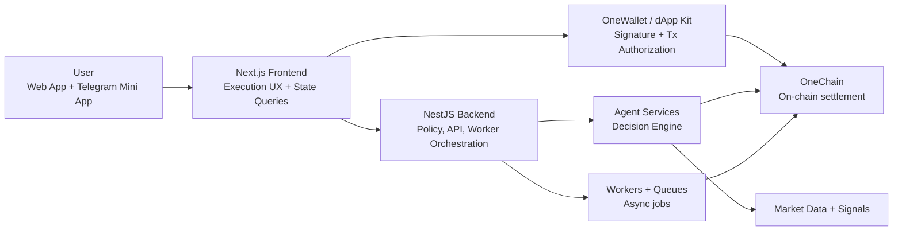
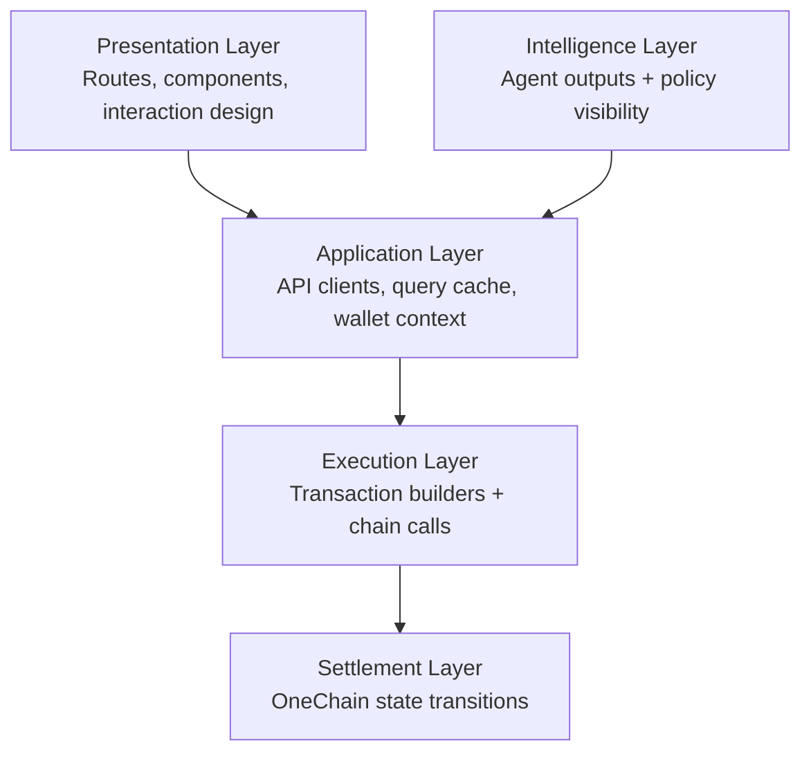
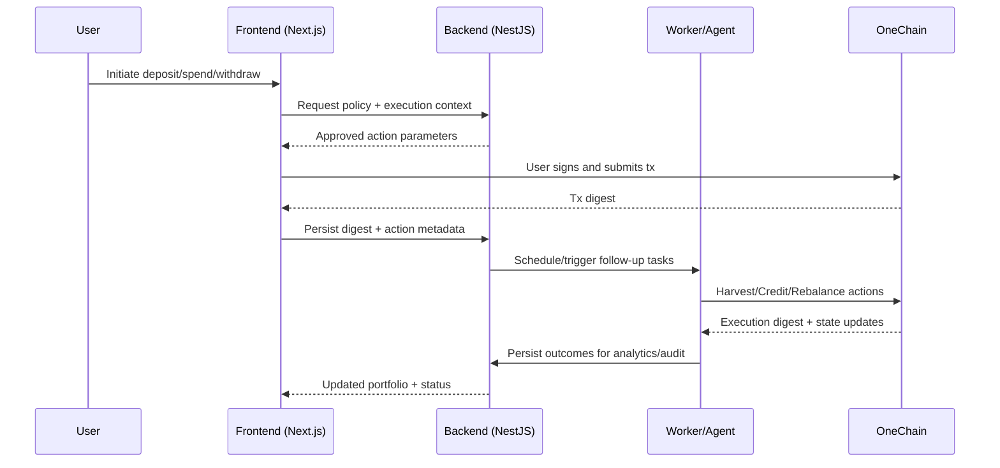

# OneYield Protocol

<p align="center">
	
</p>

<p align="center">
  <strong>Deposit once. Route intelligently. Spend responsibly. Compound continuously.</strong>
</p>

<p align="center">
	OneYield — a OneChain-native yield utility protocol that turns passive capital into adaptive, policy-guarded financial flows across frontend, backend, AI workers, and on-chain settlement.
</p>

> “In modern finance UX, trust is not a claim — it is a verifiable execution trail.”

---

## Table of Contents

1. [Executive Summary](#executive-summary)
2. [Protocol Scope (Frontend + Backend + On-chain)](#protocol-scope-frontend--backend--on-chain)
3. [Problem Statement (Why OneYield exists)](#problem-statement-why-oneyield-exists)
4. [Solution Thesis](#solution-thesis)
5. [Product Architecture (In Depth)](#product-architecture-in-depth)
6. [Backend Control Plane (NestJS)](#backend-control-plane-nestjs)
7. [Agentic Intelligence Pipeline](#agentic-intelligence-pipeline)
8. [End-to-End Settlement Lifecycle](#end-to-end-settlement-lifecycle)
9. [Security & Trust Model](#security--trust-model)
10. [Protocol Capabilities](#protocol-capabilities)
11. [API Surface](#api-surface)
12. [Repository Structure](#repository-structure)
13. [Tech Stack](#tech-stack)
14. [Environment Configuration](#environment-configuration)
15. [OneChain Deployment Snapshot + Explorer Proof](#onechain-deployment-snapshot--explorer-proof)
16. [Runbook: Local Development](#runbook-local-development)
17. [Production Readiness Checklist](#production-readiness-checklist)
18. [Future-Secured Path (TEE + Attestation)](#future-secured-path-tee--attestation)
19. [OneYield × OneChain Growth Path](#oneyield--onechain-growth-path)
20. [Production Operations Model](#production-operations-model)

---

## Executive Summary

OneYield solves a structural DeFi contradiction: users want compounding exposure and real-life liquidity at the same time.

The protocol delivers this through a coordinated full-stack system:

- **Frontend (Next.js):** user execution UX, wallet flows, portfolio and lane visibility
- **Backend (NestJS):** policy engine, orchestration APIs, worker scheduling, auth/session control
- **Agent workers:** periodic harvest/credit loops and policy-bound execution tasks
- **On-chain modules (OneChain):** vault, spend buffer, lane router, token primitives, DEX/predict integrations
- **Operational data plane:** observability, transaction traceability, and audit-friendly execution records

In short, this is not just an app. It is a production-oriented protocol stack for programmable yield utility.

---

## Protocol Scope (Frontend + Backend + On-chain)

OneYield is presented as a complete protocol, not a UI-only project.

### 1) User interaction layer (Frontend)
- Wallet connection and transaction signing (OneWallet)
- Deposit, spend, and withdraw flows
- Strategy and lane intelligence views

### 2) Decision and policy layer (Backend + Agent services)
- API contracts for portfolio, vault, lane, spend, and agent status
- Policy validation before action execution
- Worker-based recurring loops for yield harvest and yield crediting

### 3) Settlement layer (OneChain)
- Principal and yield accounting in protocol objects
- Spend rails for yield-first settlements
- Router-managed deployment/harvest actions

### 4) Production layer (Ops + security)
- Failure-aware retries and worker isolation
- Correlated traceability between API events and tx digests
- Progressive hardening path to TEE-attested decisions

---

## Problem Statement (Why OneYield exists)

### The market problem

Most yield products are built around delayed utility:

1. deposit funds,
2. lock for yield,
3. wait for redemption,
4. only then access spendability.

This creates three practical failures:

- **Liquidity lag**: capital is productive but not usable.
- **Behavioral churn**: users break compounding loops to satisfy short-term needs.
- **Static allocation drag**: fixed strategy weights underperform in changing market conditions.

### The product requirement

A modern yield system must be:

- **programmable** (policy-driven decisions),
- **adaptive** (dynamic routing),
- **trustworthy** (clear guardrails and verifiability),
- **usable** (consumer-grade transaction UX).

> “Static allocation is easy to explain. Adaptive allocation is what survives real markets.”

---

## Solution Thesis

OneYield combines three layers into one coherent financial primitive:

1. **On-chain primitives** for principal, yield rights, and spend rails
2. **Agentic intelligence** for routing decisions under constraints
3. **Execution UX** that makes complex finance operable for real users

The frontend anchors this by making every critical state transition observable and actionable.

---

## Product Architecture (In Depth)

### Macro architecture



### Functional layering



---

## Backend Control Plane (NestJS)

The backend is the protocol control plane that turns strategy intent into safe executable actions.

### Responsibilities

- Authentication and session management (wallet + mini app compatibility)
- Portfolio and spend APIs consumed by the frontend
- Policy checks before execution
- Worker orchestration for periodic yield jobs
- Persistence of transaction references and execution outcomes

### Core execution model

1. Receive user or scheduler intent
2. Validate policy and current state
3. Build approved action payload
4. Execute via chain adapter / signer path
5. Store result + digest + status for UI and audit retrieval

### Worker-driven protocol loops

- `YieldHarvestService`: harvests from connected venues into protocol reserves
- `YieldCreditService`: computes user deltas and credits spend balances
- Watch/process flows: track async completion and recover from transient failures

### Design principles

- **Financial clarity over UI cleverness**
- **Policy transparency over black-box automation**
- **Separation of concerns** (UI vs policy vs execution)
- **Deterministic, recoverable user flows**

---

## Agentic Intelligence Pipeline

The frontend renders and explains a seven-stage decision loop used for adaptive capital routing.

### Current pipeline (v1)

1. **Signal Ingestion**
	- Reads vault state, lane state, market state, and protocol context
	- Incorporates premium market context, including x402-mediated CoinGecko data paths, for higher-quality routing signals
2. **Feature & Context Builder**
	- Converts raw telemetry into normalized strategic context
3. **Policy + Intelligence Engine**
	- Generates risk-adjusted, policy-aware action proposals
4. **Guardrails & Compliance Checks**
	- Applies hard constraints before action approval
5. **Worker Orchestration**
	- Schedules approved actions with retry and isolation semantics
6. **On-chain / Service Execution**
	- Settles approved actions and synchronizes system state
7. **Telemetry & Learning Loop**
	- Evaluates outcomes and feeds improvements into future cycles

### Pipeline visual


### Why this matters

This pipeline transforms OneYield from static vault allocation to adaptive capital orchestration with explicit safety boundaries.

> “The agent does not replace risk policy — it operates inside it.”

---

## End-to-End Settlement Lifecycle



---

## Security & Trust Model

### Current controls

- Wallet-signature-first authentication
- JWT + refresh model with Telegram Mini App silent re-auth path
- Policy-gated execution (no direct unguarded decision actioning)
- User-signed on-chain transactions for critical operations
- Role separation between UI, policy services, and execution workers

### Threats considered

- prompt/context poisoning in agent workflows
- auth/session misuse
- replay and stale-state action risks
- UI/chain state divergence risks

### Operational trust posture

Security is implemented as layered control, not a single mechanism.

> “Security maturity = policy constraints + execution isolation + auditability.”

---

## Protocol Capabilities

- Wallet connect and signing via `@onelabs/dapp-kit`
- On-chain transaction UX for:
  - vault deposit
  - spend buffer settlement
  - principal withdrawal
- Portfolio + lane visibility through backend APIs
- Agent status and decision feeds
- Spend rails and transaction history views
- Faucet onboarding utilities for testnet users
- Telegram Mini App auth compatibility
- Backend-driven periodic harvest/credit operations
- Traceable tx digest lifecycle across UI → API → worker → chain

---

## API Surface

Centralized clients live in `lib/api/client.ts`:

- `authApi` — nonce, verify, refresh, mini app auth
- `userApi` — user profile and portfolio
- `vaultApi` — vault previews, submit flow, positions
- `strategyApi` — strategy registry and allocation updates
- `agentApi` — status, decisions, manual trigger
- `transferApi` — transfer send/history/balance
- `cardApi` — card lifecycle and history
- `telegramApi` — linking lifecycle
- `laneApi` — lane allocation and decision history
- `faucetApi` — OCT and USD balance/faucet
- `spendApi` — spend balance, qr-pay, history

---

## Repository Structure

```text
SmartYeild/
├── frontend/              # Next.js protocol interface (this repo)
│   ├── app/               # Route groups: dashboard, docs, workflow, landing
│   ├── components/        # Shared and feature components
│   ├── lib/               # API clients, chain config, wallet providers
│   └── public/            # Branding and static assets
├── Backend/               # NestJS control plane + worker orchestration
│   ├── src/modules/       # Auth, agent, vault, spend, chain modules
│   └── scripts/           # Operational/manual chain scripts
├── onechain/              # Deployment artifacts and object/package IDs
└── contracts/             # Move/Solidity contract workspaces and artifacts
```

---

## Tech Stack

- **Frontend**: Next.js 16 (App Router), React 19, TailwindCSS 4, Radix, Motion
- **Backend**: NestJS, TypeScript, scheduled workers/processors
- **State/Data**: TanStack Query, Zustand (frontend), service persistence (backend)
- **Chain/Wallet**: `@onelabs/dapp-kit`, `@onelabs/sui`, OneChain RPC
- **Protocol modules**: `vault`, `spend_buffer`, `lane_router`, `mock_onedex`, `mock_onepredict`
- **Notifications/UX**: Sonner

---

## Environment Configuration

Create `.env.local` from `.env.local.example`.

```dotenv
NEXT_PUBLIC_API_URL=https://your-backend-url

NEXT_PUBLIC_ONECHAIN_RPC_URL=https://rpc-testnet.onelabs.cc
NEXT_PUBLIC_ONECHAIN_PACKAGE_ID=
NEXT_PUBLIC_ONECHAIN_VAULT_OBJECT_ID=
NEXT_PUBLIC_ONECHAIN_SPEND_BUFFER_OBJECT_ID=
NEXT_PUBLIC_ONECHAIN_LANE_ROUTER_OBJECT_ID=
```

Notes:

- If `NEXT_PUBLIC_API_URL` is omitted, fallback is used from `lib/api/client.ts`.
- Package/object IDs must match the deployed OneChain environment.
- Backend control plane must use the same package/object IDs to keep settlement paths consistent.

---

## OneChain Deployment Snapshot + Explorer Proof

> “Every important claim should map to an object ID or transaction digest.”

Deployment source of truth: `../onechain/deployed.json`

### Testnet deployment snapshot (March 15, 2026)

| Field | Value |
|---|---|
| Network | `testnet` |
| RPC URL | `https://rpc-testnet.onelabs.cc` |
| Package ID | `0xfa477ea107d411f41a2b2e0312c5edb891c69dc2a414845cd38790479dbe860c` |
| Vault Object | `0x841d959881a94260c07cbd378b790fad5417b5250f455d808ce8ce0f4fdb5a40` |
| Spend Buffer Object | `0x5719e64ccb1f0956bc6f9193fe9bdc9a44ddbc5eb265ce3dc1871695294581bf` |
| Lane Router Object | `0x7356be323c2ee4b8bda59594aaed669add371eba164c3cc18a878d56f8555e5f` |
| OneDex Object | `0x1786615c5f3561b44875a2b4e41b64ca36a7d7a33326638cd95cef900f0b459f` |
| Prediction Market Object | `0x5bc1e9815c957c871749a8f44296eaa9398954932dc63d11014621dfdc887fe0` |

### Verified transaction proofs (clickable)

> Explorer base (as requested): [OneScan Testnet Home](https://onescan.cc/testnet/home)

| Operation | Digest | OneScan Link |
|---|---|---|
| Faucet mint 100 USD | `EvaVErpsEQVpT6p6VHMGZE9yAC68jTkXqapRVZ1pSue3` | [Open tx](https://onescan.cc/testnet/transactionBlocksDetail?digest=EvaVErpsEQVpT6p6VHMGZE9yAC68jTkXqapRVZ1pSue3) |
| Add DEX liquidity (50 USD) | `HgngwysQ19d7yogcKKLb3okwWyw3cRLAKk1SsqSJiDzx` | [Open tx](https://onescan.cc/testnet/transactionBlocksDetail?digest=HgngwysQ19d7yogcKKLb3okwWyw3cRLAKk1SsqSJiDzx) |
| Simulate trading fees (0.22 USD) | `2Gau915sX5P19H26QDRdBEt1HdgwoBV2ZhMJWqdyWqrk` | [Open tx](https://onescan.cc/testnet/transactionBlocksDetail?digest=2Gau915sX5P19H26QDRdBEt1HdgwoBV2ZhMJWqdyWqrk) |
| Harvest DEX yield | `5dm9AAbB8p8PgKL2jqwKWPirH7c4vnsHZWdGkZJXwBvs` | [Open tx](https://onescan.cc/testnet/transactionBlocksDetail?digest=5dm9AAbB8p8PgKL2jqwKWPirH7c4vnsHZWdGkZJXwBvs) |
| Credit advance (7 USD) | `3vmMzsFMxTgiJy1UbJDM33c5HLmLHRhyrXC9c81fuRj4` | [Open tx](https://onescan.cc/testnet/transactionBlocksDetail?digest=3vmMzsFMxTgiJy1UbJDM33c5HLmLHRhyrXC9c81fuRj4) |

If OneScan route behavior changes, open [OneScan Testnet Home](https://onescan.cc/testnet/home) and paste the digest in search.

---

## Runbook: Local Development

### 1) Install dependencies

```bash
pnpm install
```

### 2) Set environment

```bash
cp .env.local.example .env.local
# fill values
```

### 3) Start frontend

```bash
pnpm dev
```

Default URL: `http://localhost:3000`

### 4) Start backend (workspace root)

```bash
cd ../Backend
pnpm install
pnpm start:dev
```

Backend default URL is typically `http://localhost:3001` (validate against local backend config).

---

## Production Readiness Checklist

- [ ] Strict security headers + CSP
- [ ] Centralized error boundaries for critical routes
- [ ] Hardened wallet/session edge-case handling
- [ ] API timeout/backoff strategy with user-safe messaging
- [ ] End-to-end tests for deposit/spend/withdraw paths
- [ ] Release validation for contract IDs and RPC target
- [ ] Runtime monitoring dashboards + alerting
- [ ] Incident playbooks for degraded chain/API states

---

## Production Operations Model

This frontend is designed to operate as part of a production-grade distributed system, not a standalone website.

### 1) Reliability targets (recommended)

- **Availability SLO:** 99.9% monthly for user-facing routes
- **API interaction success SLO:** ≥ 99.5% (excluding upstream chain outages)
- **P95 page-interactive latency target:** < 2.5s on stable networks
- **P95 tx-initiation UX latency target:** < 1.2s (wallet popup readiness)

### 2) Deployment posture

- Immutable build artifacts per release
- Environment-specific contract IDs and RPC endpoints
- Release gates that block deploys on missing chain config
- Blue/green or canary rollouts for high-risk changes

### 3) Observability stack expectations

- Structured frontend error capture (route, wallet state, chain context)
- Correlation IDs between frontend API calls and backend job execution
- Dashboard panels for:
	- auth refresh failures,
	- tx submission failures,
	- spend settlement UI/API mismatch,
	- lane/agent data staleness.

### 4) Incident handling posture

- User-safe degraded modes for temporary chain/API instability
- Explicit status messaging when state may be stale
- Fast rollback path with previous known-good env + build pair

### 5) Change management

- Treat contract/config updates as production migrations
- Version UI behavior against backend API schema changes
- Require smoke verification on deposit, spend, and withdraw before promotion

---

## Future-Secured Path (TEE + Attestation)

To protect agentic decision integrity against prompt injection and context tampering, OneYield roadmap includes trusted enclave execution.

### Planned TEE trajectory

1. Move sensitive decision computation into Trusted Execution Environments (TEEs)
2. Isolate prompts, policy context, and intermediate reasoning artifacts
3. Produce cryptographic attestation proofs per decision epoch
4. Expose attestation metadata in operator and user-facing surfaces
5. Enforce policy: only attested decision bundles can progress to execution queues

Outcome target: **adaptive intelligence with verifiable integrity**.

---

## OneYield × OneChain Growth Path

OneYield grows with OneChain through compounding utility loops:

1. **Distribution scale**: Telegram Mini App expansion
2. **Payments utility**: iPhone-first user flows and smoother spend settlements
3. **Liquidity depth**: tighter OneDex-aware routing feedback
4. **Signal richness**: broader OnePredict-informed decision context
5. **Trust layer maturity**: TEE-attested policy execution

### Strategic north star

Build the most understandable, secure, and adaptive frontend for programmable yield utility in the OneChain ecosystem.

> “As OneChain liquidity deepens, OneYield becomes the intelligence layer that routes capital with discipline, not hype.”

---

### License

Private/internal at current stage unless repository owner states otherwise.
